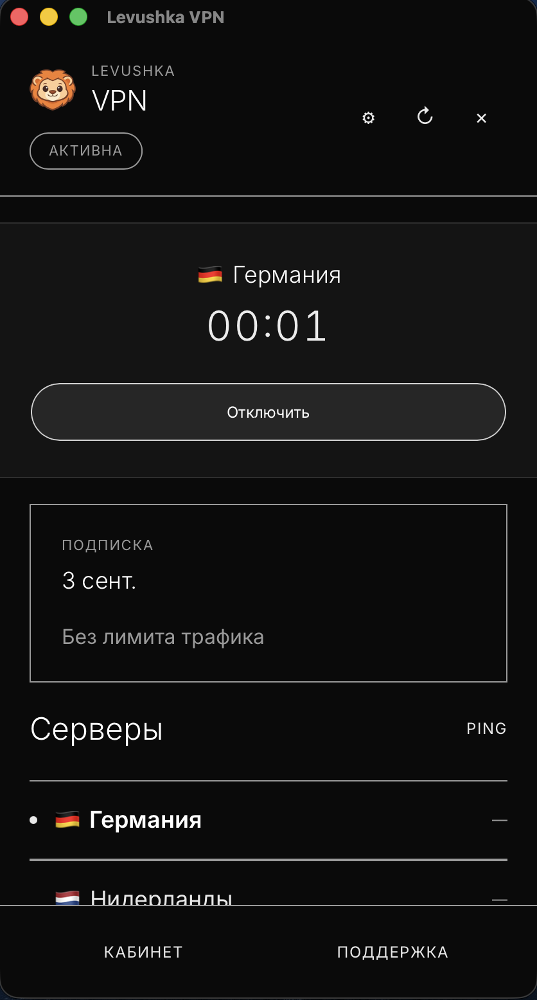
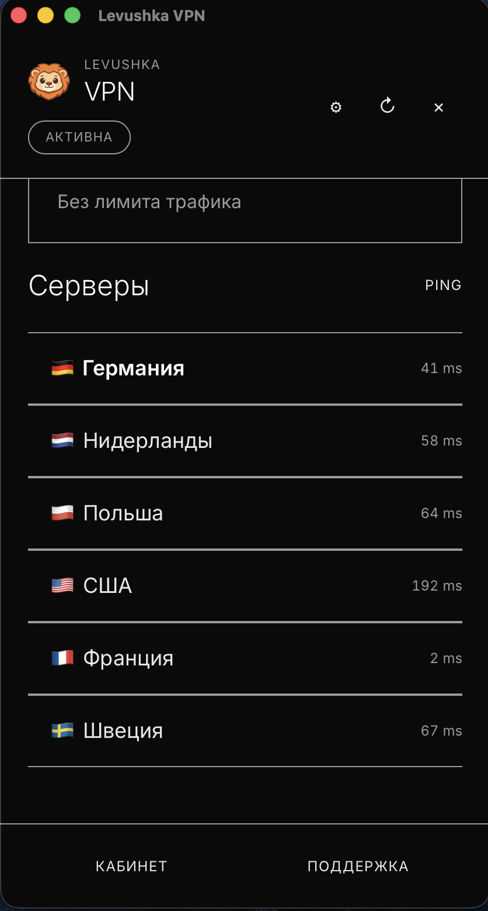
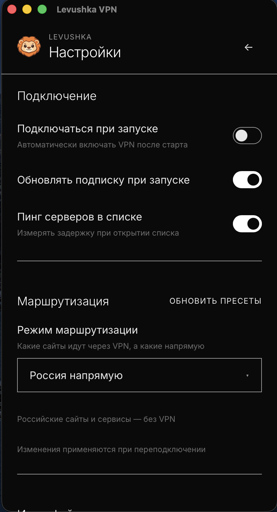
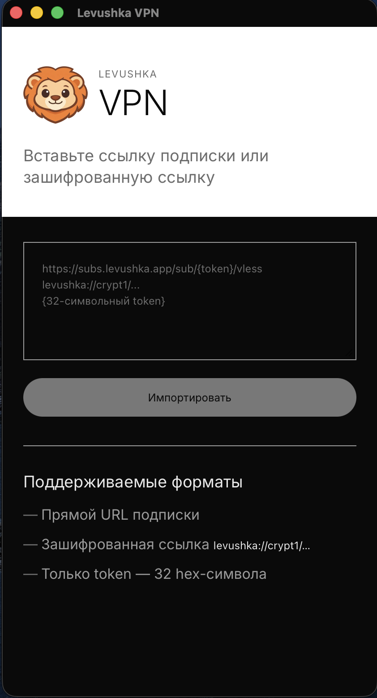

# Levushka VPN — Client

<p align="center">
  <a href="README.md">Overview</a> ·
  <a href="README.ru.md">Русский</a> ·
  <strong>English</strong>
</p>

**Levushka VPN** is a native client for the [Levushka VPN](https://levushka.app) service on **macOS**, **Windows**, and **Android**. It uses a full-system **TUN tunnel**, not just a browser proxy, so Telegram, games, and other apps that ignore system proxy settings work correctly.

## Download

| Platform | Version | Link |
|----------|---------|------|
| macOS (Apple Silicon) | 0.3.5 | [app.levushka.app/desktop/macos](https://app.levushka.app/desktop/macos/) |
| Windows 10/11 x64 | 0.3.5 | [app.levushka.app/desktop/windows](https://app.levushka.app/desktop/windows/) |
| Android 8+ (APK) | 0.4.0 | [app.levushka.app/desktop/android](https://app.levushka.app/desktop/android/) |

All platforms: [app.levushka.app](https://app.levushka.app) · Subscription & account: [my.levushka.app](https://my.levushka.app)

## Features

### Subscription & import

- Import via `https://subs.levushka.app/sub/{token}/vless`
- Import by token (32 hex characters)
- Encrypted links `levushka://crypt1/...`
- Deep link `levushka://import?url=...` from browser or bot
- Auto-refresh subscription (hourly by default)
- Subscription status: active, expired, device limit
- Traffic and expiry from HTTP headers (Happ-compatible)

### VPN

- **Full TUN tunnel** — system-wide traffic through VPN (with configurable exceptions)
- **VLESS** via [Xray-core](https://github.com/XTLS/Xray-core)
- On Android: **VpnService** + xray + hev-socks5-tunnel (same UX as macOS)
- Server list with **TCP ping**
- One-click connect / disconnect
- Tray icon, session timer, auto-connect on launch (desktop)

### Routing

Presets are fetched from the server and update without reinstalling the app:

- **All via VPN** — full tunnel
- **Russia direct** — Russian IPs and popular local services bypass VPN
- **Custom** — manual domain lists (direct or proxy-only)

### UI & settings

- Russian and English
- Light / dark / system theme
- Text scale
- IPv4 / IPv6 preference
- In-app update checks
- Launch at login (macOS)

## Screenshots

| Connected | Server list |
|:---:|:---:|
|  |  |

| Routing | Import |
|:---:|:---:|
|  |  |

## Getting started

1. Download and install the app for your OS.
2. Get your subscription link from the [Telegram bot](https://levushka.app) or [personal account](https://my.levushka.app).
3. Paste the link on the import screen (or open a `levushka://` link).
4. Pick a server and tap **Connect**.

On first connect, macOS or Windows will ask for administrator approval to install the network helper and TUN routes. Android asks for VPN permission. This is a one-time step.

## Requirements

| | macOS | Windows | Android |
|---|--------|---------|---------|
| OS | macOS 12+ (Apple Silicon recommended) | Windows 10/11 x64 | Android 8+ (API 24+) |
| Privileges | Admin on first connect | UAC on first connect | VPN permission |
| Network | Internet for subscription & geo assets | Same | Same |

## Architecture (overview)

```
┌─────────────────────┐
│  Levushka VPN (UI)  │  Tauri + React — user session
└──────────┬──────────┘
           │ IPC
┌──────────▼──────────┐
│  Privileged helper  │  Routes, DNS, xray process
└──────────┬──────────┘
           │
┌──────────▼──────────┐
│  Xray-core (TUN)    │  VLESS → VPN server
└─────────────────────┘
```

Subscription and billing live on `subs.levushka.app` and the web account. The app is a thin client: fetch configs, bring up the tunnel, show status.

## Import formats

| Format | Example |
|--------|---------|
| Full URL | `https://subs.levushka.app/sub/{token}/vless` |
| Token only | `a1b2c3d4...` (32 chars) |
| Encrypted | `levushka://crypt1/{payload}` |
| Deep link | `levushka://import?url=https://...` |

## Updates

The app checks `app.levushka.app` for updates and can install new builds in place. See [CHANGELOG.md](CHANGELOG.md) for release history.

## Security

- Subscription stored locally in an app-protected directory
- Stable device ID (`x-hwid`) for per-subscription device limits
- Routing manifests and geo databases are Ed25519-signed
- Vulnerability reports: [SECURITY.md](SECURITY.md)

## What this repository contains

This is a **public product showcase**: docs, changelog, issues, download links.

Application source, signing keys, and internal release scripts are **not published** (private dev repo). See [docs/publishing.md](docs/publishing.md).

## Feedback

- Bugs & ideas: [GitHub Issues](https://github.com/MihichN/levushka-desktop/issues)
- Website: [levushka.app](https://levushka.app)

## License

See [LICENSE](LICENSE). Binary builds are distributed by Levushka. Documentation in this repo may be reused with attribution.
